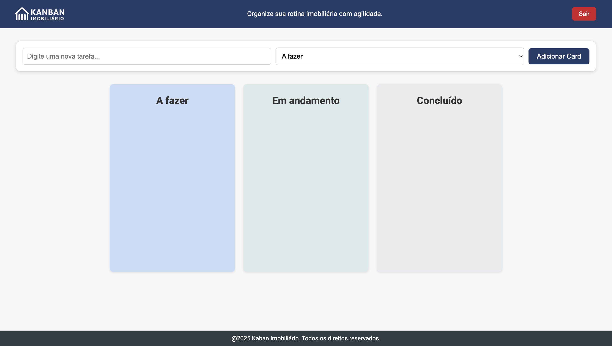

# 🏠 Kanban Imobiliário

Plataforma web simples e intuitiva desenvolvida para ajudar corretores de imóveis a organizarem suas tarefas, visitas e negociações utilizando o método ágil **Kanban**.

---

## Sobre o projeto

Este projeto foi desenvolvido como atividade de extensão do curso de **Engenharia de Software**, com o objetivo de aplicar práticas ágeis (Scrum/Kanban) em uma solução real voltada a profissionais da área imobiliária.

---

## ✨ Funcionalidades

✅ Cadastro e login de corretores (simulado com LocalStorage)
✅ Quadro Kanban com 3 colunas: A Fazer, Em Andamento e Concluído
✅ Criação e exclusão de tarefas
✅ Arraste de cards entre colunas (drag and drop)
✅ Layout responsivo
✅ Feedbacks visuais com SweetAlert2
✅ Armazenamento de tarefas no navegador com **LocalStorage**
✅ Botão de logout com confirmação

---

## 🧪 Tecnologias Utilizadas

- **HTML5**
- **CSS3**
- **JavaScript**
- **SweetAlert2**
- **LocalStorage**

---

## 🖼️ Layout

O layout foi pensado para ser intuitivo e responsivo, com destaque para o contraste visual e facilidade de uso em dispositivos móveis.  
Veja abaixo uma prévia:

### 📌 Página de Cadastro


### 📌 Página de login


### 📌 Quadro Kanban


---

## 📁 Estrutura de pastas

```
kanban-imobiliario/
├── index.html
├── login.html
├── register.html
├── script.js
├── auth.js
├── protect.js
├── style.css
├── auth.css
└── assets/
    ├── logo.png
    ├── trash-solid.svg
    └── capturas-tela/
        ├── Register.png
        └── Login.png
        └── kanban.png
```


